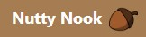
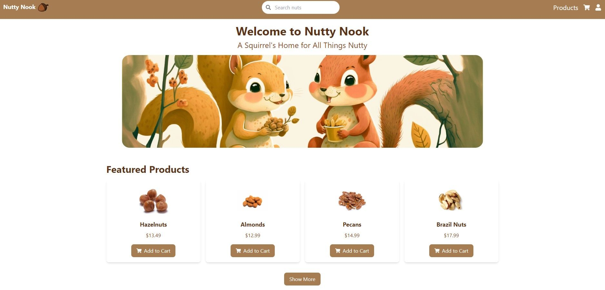
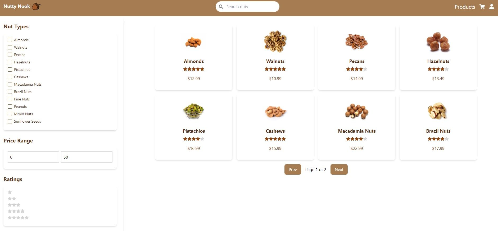

 
Nutty Nook is designed to offer a smooth, engaging, and tailored shopping experience for squirrel customers seeking a diverse range of high-quality nuts. With an intuitive user interface, advanced search and filtering options, and seamless checkout and payment process, the application aims to revolutionize the nut-buying experience in the squirrel community, providing a convenient and delightful one-stop destination for all their nut needs.

 
 

 

## Description

### Frontend

For the frontend, React was used to build the application's UI components, offering flexibility and efficient rendering. Tailwind CSS was employed for a visually appealing and responsive design, ensuring an engaging user experience on various devices.

 

### Backend

 On the backend, Node.js provided a robust runtime environment for the server-side, enabling the development of scalable and high-performance APIs. MongoDB served as the primary database, ensuring efficient storage and retrieval of product and order information. To ensure secure user authentication and authorization, JSON Web Tokens (JWT) were implemented, providing a stateless and reliable method for managing user sessions. 

 

### Payments

For handling payments, the Stripe API was integrated, offering a secure and user-friendly solution for processing transactions. Redux was employed to maintain a consistent application state, ensuring data is easily accessible and updated across the application, enhancing the overall user experience.

 
